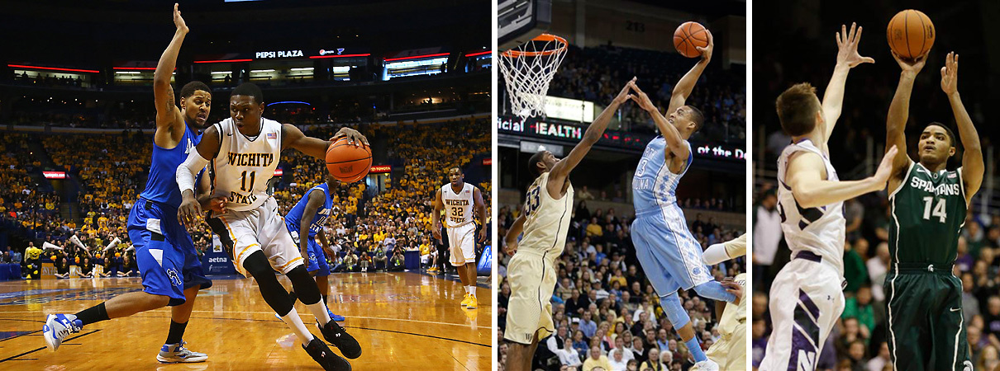

# Basketball Jones

### Background and motivation
I like college basketball. I follow it on TV, on the Web and in newspapers. I read game summaries and analysis, pore over box scores, fret over the standings and chew on statistics. 

The season is soon ending. Before long, we'll have an entire season to look back on and try to make sense of. As a fan, I'm interested in performance--of players, teams, conferences. And I'm interested in comparing performance.

### Project objectives
College basketball junkies love statistics. But data, as found on popular sites like ESPN.com, Yahoo! Sports and Sports-Reference.com, as well as in newspapers, have one thing in common: They're tabular. Apparently, that's by convention. I'd like to reinvent descriptive statistics for college basketball as visualizations.

For this project, I'd like visually contextualize the week-to-week performance of all 351 Division-1 teams, 32 conferences, and more than 4,000 players in the 2013-14 season. 

For player entities, attributes include routine statistical categories like points per game, rebounds, assists. For team and conference entities, the attributes can include those as well as, across the course of the season, winning percentage and average position in polls. 

The question I want to answer: How does the performance of this team, this player, this conference measure up?

### Data
For player, team, conference and game data, I can scrape ESPN.com and Sports-Reference.com. The [latter](http://www.sports-reference.com/cbb/schools/) looks especially promising because it makes many tables available as csv files. I anticipate getting a good portion of my player, team and conference data there. 

I found and tested some Python scripts on Github for scraping Sports-Reference.com. I may fork [the repo](https://github.com/yankovai/College-Basketball-Prediction) and adapt the scripts to my project's needs.

Because the season is not yet over, I may use 2012-13 season data so I don't have to worry about rescraping as this season plays out.

### Data processing
I don't expect to need to clean the data substantially. From my initial tests, my data sources appear to be structured consistently. I expect to spend more time writing scripts to scrape the data than cleaning it. Although if the need arises, I will look to Excel, [csvkit](http://csvkit.readthedocs.org/en/latest/) and regular-expression find-change operations in our text editors.

I believe all of the data--the player, team and conference statistics we're interested in--will be available on ESPN.com, Sports-Reference.com and TeamRankings.com, as described above. 

### Visualization

I expect to build the main visualization to be styled as parallel coordinates, with all ~350 Division 1 teams shown. The attributes will be season totals for stats like field-goal percentage, points-per-game, assists, turnovers, steals, winning-percentage, three-point percentage and free-throw percentage.

The user will be able to select a team by mousing over the parallel coordinates vis or typing a team name into an ajaxified search box. In addition, multiple teams will be selectable by brushing the main vis or selecting a conference from a dropdown, which will highlight all the teams in the at conference.

Below, the selected team or teams will appear in a table. The table will have the precise numbers for statistics tracked on the main parallel coordinates vis.

Clicking on a team on the table will bring up a representation of every game the team played. The games will be visualized by a bar chart, with bar color denoting the game's result (win or loss) and bar value denoting the result's margin. Mousing over a bar will activate an small visual representation of the game, with a star plot showing both teams' performance across several categories (field-goal percentage, assists, turnovers, etc.), as well as text showing opponent, game date, and other game particulars.

### Must-have features
The project must be able to display season totals and game totals for every Division 1 college basketball team during the season. That covers around 350 teams and some 5,000 games.

### Optional features
An optional feature is drilling down to individual players. 

### Project schedule
A tentative schedule (subject to change) is as follows:
* April 6 - Most data downloaded 

* April 9 - Main visualization created

* April 10 - Functional prototype working

* April 17

* April 24

* May 1
