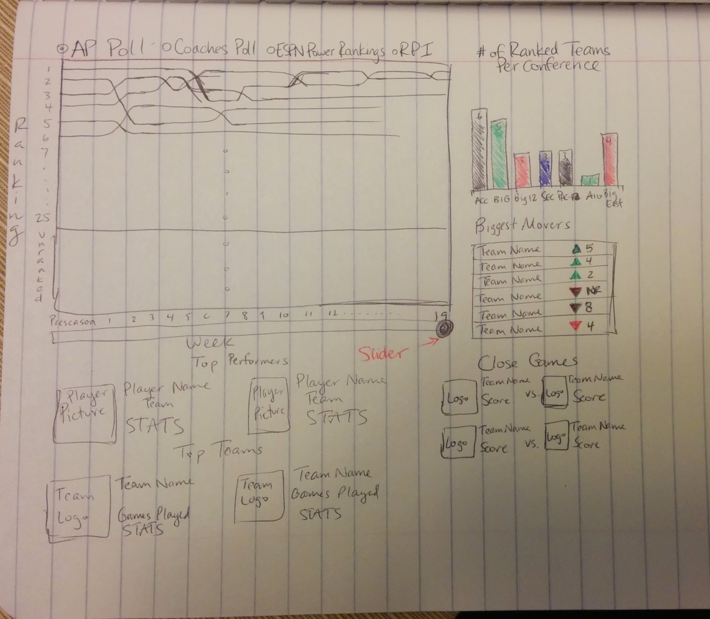

# I Got a Basketball Jones

### Background and motivation
We like college basketball. We follow it on TV, on the Web and in newspapers. We read game summaries and analysis, pore over box scores, fret over the standings and chew on statistics. 

The season is soon ending. Before long, we'll have an entire season to look back on and try to make sense of. As fans, we're interested in performance--of players, teams, conferences. And we're interested in comparing performance.

### Project objectives
College basketball junkies love statistics. But data, as found on popular sites like ESPN.com, Yahoo! Sports and Sports-Reference.com, as well as in newspapers, have one thing in common: They're tabular. Apparently, that is by convention. We'd like to reinvent descriptive statistics for college basketball as visualizations.

For this project, we'd like visually contextualize the performance of all 351 Division-1 teams, 32 conferences, and more than 4,000 players in the 2013-14 season. 

For player entities, attributes include routine statistical categories like points per game, rebounds, assists. For team entities, the attributes can include those as well as, across the course of the season, winning percentage, position in polls, RPI ratings, winning streaks, conference standing. For conferences, we can look at points and other usual statistical categories, in addition to winning percentage, poll representation, RPI ratings and record against other conferences.

The question we want to answer: How does the performance of this team, this player, this conference measure up?

### Data
For player, team, conference and game data, we can scrape ESPN.com and Sports-Reference.com. The [latter](http://www.sports-reference.com/cbb/schools/) looks especially promising because it makes many tables available as csv files. We anticipate getting a good portion of our player, team and conference data there. One of ESPN.com's strengths is its excellent [play-by-play data](http://espn.go.com/ncb/playbyplay?gameId=400543735), which we may tap for visualizing a game's lead changes. 

We found and tested some Python scripts on Github for scraping Sports-Reference.com. We may fork [the repo](https://github.com/yankovai/College-Basketball-Prediction) and adapt the scripts to our needs.

For every team, we are interested in tracking through the season its overall RPI and strength-of-schedule RPI. We would also like to track conference RPI and conference strength-of-schedule RPI. RPI ratings for all 351 teams and 32 conferences, for each day of the season, are available at http://www.teamrankings.com/ncb/rpi/.

The site uses an Ajax call to retrieve these values by calendar day. Using curl, we can retrieve the RPI rating on a given day as an HTML table, which we can then scrape. Here's a curl command to retrieve the table of the RPI ratings for all 351 teams, for instance, on Dec. 11, 2013:

    curl --data "type=detail&league=ncb&rating_id=514&season_id=311&cat_type=2&view=team_v2&view_type=team&table_view=team_v2&force_period_id=&is_rpi_ranking=1&date=12%2F11%2F2013" http://www.teamrankings.com/ajax/league/v3/rankings_controller.php

Similar methods can be used on this site to get strength-of-schedule ratings, for teams and conferences.

### Data processing
We don't expect to need to clean the data substantially. From our initial tests, our data sources appear to be structured consistently. We expect to spend more time writing scripts to scrape the data than cleaning it. Although if the need arises, we will look to Excel, [csvkit](http://csvkit.readthedocs.org/en/latest/) and regular-expression find-change operations in our text editors.

We believe all of the data--the player, team and conference statistics we're interested in--will be available on ESPN.com, Sports-Reference.com and TeamRankings.com, as described above. 

### Visualization
The main visualization will have a simple line graph that shows a weekly ranking of the top 25 teams with a selector for the poll (AP, Coaches/USA Today, ESPN Power Rankings, RPI, etc). A slider will be used to select the desired week. For each week, a separate column chart will display the number of ranked teams per conference. The biggest gainers and losers (# of places moved up/down in the poll versus previous week) will be listed. Top teams and players for that given week will be displayed below the polls graph. Any close or interesting games will be highlighted as well.

From the main visualization, a user should be able to click on a team or conference and access their relevant stats. The same goes for accessing a particular player.

### Must-have features
We must be able to display information for every college basketball team, conference, and player. The ability to step through a season at least on a weekly basis is a must as well for the main visualization.

### Optional features
An optional feature we might want to add is the ability to import and visualize previous seasons. We might want to go back to the introduction of the Coaches Poll in 1993-94 or perhaps back to the introduction of a 64-team NCAA Tournament format in 1985. 

### Project schedule
A tentative schedule (subject to change) is as follows:
* Sunday March 23 - Have data downloaded and in repository, sketch visualizations for display of conference/team/player
* Sunday March 30 - Create main visualization
* Sunday April 6 - Conference/Team/Player visualizations created
* Thursday April 10 - Functional Prototype Due
* Thursday April 17
* Thursday April 24
* Thursday May 1